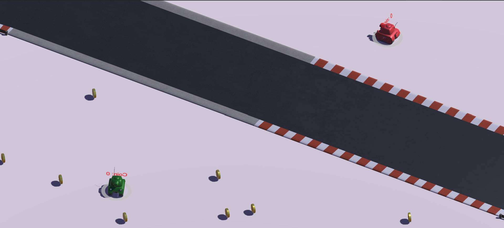

# IF3210-2021-Unity-K3-03
**Tugas Besar 2 PBD - Unity Tanks Extended**

## DESCRIPTION TANKS EXTENDED
> Sebuah Permainan Aplikasi lanjutan dari Unity Tanks dengan fitur-fitur serta mode tambahan seperti ada 2 map baru yaitu track map dan winter. Lalu ada sejumlah hingga 3 game mode baru, yaitu:
1. Winter map
2. Race map
3. Coin Collections
>Permainan ini bersifat multiplayer sehingga Anda bisa bermain bersama pemain lainnya.

## Program UI

## HOW TO PLAY
1. Pada saat di main menu, silahkan masukan nama pemain pertama dan kedua.
2. Pilih Game Mode yang Anda inginkan, terdapat total 3 pilihan game mode.
3. Anda bisa mengatur volume music dengan menggeser slidebar Volume Mixer.
4. Klik Play untuk memulai!
5. Untuk melakukan input buy character:
    - Pada P1 dengan menekan tombol E
    - Pada P2 dengan menekan tombol /
6. Untuk melakukan input buy weap:
    - Pada P1 dengan menekan tombol Q
    - Pada P2 dengan menekan tombol RIGHT SHIFT

## HOW THE GAME WORKS
*Sistem Weap:*
- Durasi weap 10 detik
- Sistemnya itu akan melakukan upgrade dengan kondisi:
    1. upgrade 0-1 150 coin
    2. upgrade 0-2 200 coin (harus di lakukan sblm durasi senjata 1 abis 10 dtiknya)

*Sistem Character:*
- Akan dilakukan secara Random.  Ada 2 character, keduanya akan hilang setelah 20 detik atau ditembak musuh, harganya 300 coin.
- 2/3 kemungkinan penguin -> heal pemanggilnya sampe dia hilang.
- 1/3 kemungkinan ayam -> membuat pemanggilnya immortal(invisible), jadi musuh harus menunggu untuk  ayam sampai hilang (bisa ditembak atau ditunggu 20 detik) untuk  bisa menyerang kembali

## LIBRARY / ASSETS
- [Tanks! Tutorial](https://assetstore.unity.com/packages/essentials/tutorial-projects/tanks-tutorial-46209)
- [Modular Track](https://assetstore.unity.com/packages/3d/environments/modular-track-85356)
- [Voxel Animals](https://assetstore.unity.com/packages/3d/characters/animals/5-animated-voxel-animals-145754)
- [Coins](https://assetstore.unity.com/packages/2d/environments/animated-2d-coins-22097#content)
- [Coin Register](https://freesound.org/people/Benboncan/sounds/91924/)

## SCREENSHOT APPLICATION

## TASKS
1. Daffa Pratama (13518033)
    - Main menu
    - Map (Winter & Race)
    - Animated character (Chicken)
    - Object collision
    - Credits
2. Arthur Edgar Y (13518090)
    - Main Menu
    - Credits
    - Coin Collection Mode
3. Naufal Arfananda (13518096)
    - Collect Coin Game Mode
    - Spawn Coin
    - Buy Weapon and Char
    - Character Behaviour
    - Weapon

